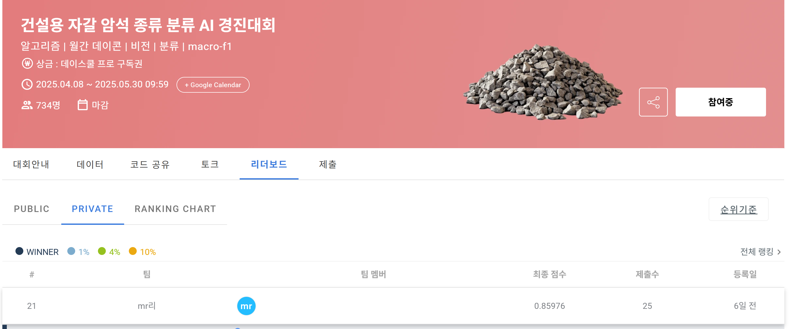

# daycon_rock_classify
데이콘 건설용 자갈 암석 종류 분류 AI 경진대회

## 대회 개요
- **대회명**: 건설용 자갈 암석 종류 분류 AI 경진대회
- **주최**: 데이콘
- **기간**: 2025.04.08 ~ 2025.05.30
- **목표**: 건설용 자갈 암석 종류를 분류하는 AI 모델 개발
- **결과**: 점수 0.86, 순위 21위/342팀, 25회 제출

---

### 알고리즘 접근
이미지 해상도가 200~500px로 다양하고, 각 암석 종류의 이미지가 불균형하게 분포되어 있어, 데이터 증강과 전이학습을 활용하여 모델의 일반화 성능을 높였습니다. 이미지 크기를 384x384로 하여, convnext, maxvit, tf_efficientnetv2_m, swin_large_patch4_window12_384 등의 모델을 적용했습니다.
epoch별로 학습률을 조정하고, early stopping을 적용하여 marco f1스코어가 top5인 epoch의 가중치를 저장했습니다.
해당 모델들을 앙상블(소프트 보팅)하여 최종 예측을 수행했습니다.

---

### 후기 및 소감
대회 기간 동안 다양한 모델을 실험해보며, 특히 전이 학습과 데이터 증강의 중요성을 다시금 실감할 수 있었습니다.
처음에는 ResNet50을 사용해 성능이 0.5614로 다소 낮았지만, ConvNeXt, MaxViT, Swin과 같은 최신 모델을 적용하면서 성능을 0.8566까지 크게 향상시킬 수 있었습니다.

하지만 유사한 구조의 모델들을 여러 번 시도하다 보니, 앙상블을 통해 더 높은 성능을 기대했음에도 오히려 성능이 저하되는 경우가 종종 발생했습니다. 이 경험을 통해, 단순한 모델 결합보다는 모델 선택과 앙상블 전략의 정교함이 성능 향상에 핵심이라는 것을 깨달았습니다.

성능을 더욱 끌어올리기 위해 관련 자료를 찾아보던 중, 스태킹(Stacking) 기법이 효과적이며, 다양한 해상도의 모델을 활용해 모델 간 다양성을 확보하는 것이 앙상블 성능 향상에 도움이 된다는 점을 알게 되었습니다. 이번 대회에서는 시간상의 제약으로 스태킹 기법을 적용하지 못했지만, 추후 대회에서는 적극적으로 활용해볼 계획입니다.

이번 경험을 통해 이미지 분류 문제에 대한 이해도를 높일 수 있었고, 다양한 최신 모델을 실험해보는 값진 시간이었습니다.

